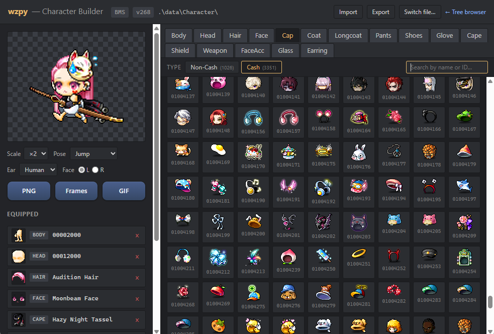

# wz-python

A Python reader for MapleStory `.wz` archives plus a small Flask UI to
browse the contents in your web browser. The parser is implemented from
scratch against the format documentation in
`Harepacker-resurrected/docs/wz-format/` (no `.NET` runtime required).

## What it supports

- Legacy 32-bit WZ container format (`PKG1` header, nested directories,
  embedded `.img` files).
- Hierarchical 64-bit pack layout used by recent GMS clients: a top-level
  `Data/<Category>/` folder containing one `<base>.wz` structure file plus
  any number of `<base>_NNN.wz` indexed siblings, with optional nested
  category subfolders. `WzPackage.open()` merges them into a single
  `WzDirectory` tree the rest of the code can treat like a normal archive.
- Standalone `.img` files extracted by other tools (e.g. HaRepacker's
  "Save Image"); truncated exports decode best-effort with a warning.
- Region encryption: `GMS`, `EMS`, `BMS` (and CLASSIC, which is BMS),
  plus arbitrary user-supplied IVs and raw keystreams.
- Auto-detection of the MapleStory patch version (WZ-level) and the
  region key (both for whole-archive and standalone-image inputs).
- All common IMG property types: `Null`, `Short`, `Int`, `Long`, `Float`,
  `Double`, `String`, `Vector`, `SubProperty`, `Canvas`, `Sound`, `UOL`,
  `Convex`.
- Canvas decoding for formats `1` (ARGB4444), `2` (ARGB8888), `3`
  (down-sampled ARGB8888), `257` (ARGB1555), `513` (RGB565), `517`
  (down-sampled RGB565), including the listWz XOR-then-zlib payload variant.
- `_outlink` / `_inlink` canvas resolution — required for hierarchical
  packs where most per-frame canvases are 1×1 placeholders pointing into
  a sibling `_Canvas` WZ that owns the actual pixels.

Out of scope for now (the format docs cover them but they require more code):

- `.ms` Snowcrypt pack files (v220+)
- `.nm` MapleStoryN files

## Setup

```sh
python -m venv .venv
.venv\Scripts\activate          # Windows
# source .venv/bin/activate     # macOS / Linux
pip install -r requirements.txt
```

## Web UI

```sh
python run.py path/to/Mob.wz
# then open http://127.0.0.1:5000
```

Hierarchical packs work the same way — point at the folder or the
structure `.wz` inside it; the package is auto-detected:

```sh
python run.py path/to/Data/Character           # hierarchical (latest GMS)
python run.py path/to/Data/Character/Character.wz
```

Region is auto-detected by default. Override or pin if needed:

```sh
python run.py path/to/Item.wz --region EMS
python run.py path/to/Map.wz  --version 83             # skip version auto-detect
python run.py path/to/UI.wz   --host 0.0.0.0 --port 8000
```

In the browser, right-click any node for export options:

- **Export data as JSON** — single file (or, on a directory, a ZIP
  containing one `<entry>.img.json` per `.img`, with a progress modal).
- **Export data as XML** — HaSuite-compatible XML dump.
- **Export images** — every `Canvas` under the node as PNGs in a ZIP,
  either preserving the tree structure or flattened.

## Character Builder



When the loaded archive is `Character.wz` (legacy or hierarchical),
the header gains a "Character Builder" link that opens a static
character composer at `/character`:

- Tabs for every equipment category (Body / Head / Hair / Face / Cap /
  Coat / Longcoat / Pants / Shoes / Glove / Cape / Shield / Weapon /
  FaceAcc / Glass / Earring) backed by `CharacterRenderer.list_parts`.
- Click a tile to equip it; the equipped list dedupes slot conflicts
  (a Longcoat replaces Coat + Pants and vice versa) and a single PNG
  preview composes on the server through `CharacterRenderer.compose`.
- **Cash / Non-Cash** sub-tab on every gear slot, driven by each img's
  `info/cash` flag.
- **Color** sub-tab on Hair (8 colors via the last digit of the ID) and
  Face (9 colors via the hundreds digit) with thumbnails that re-skin
  to the active color and an equipped-piece swap on color change.
- **Ear** selector on Head when the Head img ships multiple ear
  canvases under `front/` (`humanEar`, `lefEar`, `highlefEar`).
- **Pose** toggle (`stand1` / `stand2`) auto-shown for two-handed
  weapons; weapon equip auto-detects the right pose.
- Cap-aware z-ordering rules:
  - Caps hide hair canvases according to their `info/vslot` (token
    rule covering `H1`, `H2`, `H3`, … without the brittle length
    cutoff that misfires on edge cases).
  - `*OverCap` glasses / face accessories drop behind the bangs when
    no cap is hiding hair, **or** when the equipped cap's vslot lists
    the accessory's slot token (`Ay`, `Af`).
  - Headband-style caps (`z='cap'` with `vslot=Cp` / `CpH5`) sit
    behind the bangs; `z='capOverHair'` caps explicitly stay on top.
  - `capBelowBody` / `capAccessoryBelowBody` canvases live with the
    rest of the back-of-body cluster so the body covers them.
- "Save PNG" exports the current composite at 1× / 2× / 4× / 8× scale
  via PIL `NEAREST` upscale.

## CLI: convert_img.py

Convert WZ image data to JSON without spinning up the web UI:

```sh
# Whole archive → one <entry>.img.json per image, mirroring the WZ tree.
python convert_img.py Map.wz --region BMS

# A single entry inside the archive.
python convert_img.py Map.wz --region BMS --entry 400000000.img

# A standalone .img extracted with another tool — region auto-detected.
python convert_img.py 400000000.img --auto-region
```

For non-standard ciphers (private servers, exotic clients):

```sh
python convert_img.py exotic.img --iv 4D23C72B          # custom 4-byte IV
python convert_img.py exotic.img --auto-derive          # recover an 8-byte
                                                        # keystream from the
                                                        # 'Property' header
python convert_img.py exotic.img --keystream 96AE3FA4…  # raw keystream supply
```

If the file looks truncated mid-property (HaRepacker's "Save Image" has been
observed to drop the tail), the script emits as much JSON as it can parse
and prints a `WARNING: <name> appears truncated` to stderr.

## Library use

A normal WZ archive:

```python
from wzpy import WzFile
from wzpy.canvas import decode_canvas

with WzFile.open("Mob.wz", region="GMS") as wz:
    print("detected version:", wz.version)
    img = wz.root.get("0100100.img")        # WzImage
    stand = img.get("stand/0")              # WzCanvasProperty
    decode_canvas(stand, region="GMS").save("mob.png")

    for rel_path, image in wz.root.walk_images():
        image.parse()
        print(rel_path, len(image.children()))
```

A hierarchical 64-bit pack (latest GMS layout):

```python
from wzpy.wz_package import WzPackage

with WzPackage.open("Data/Character", region="GMS") as pkg:
    body = pkg.root.get("00002000.img")       # WzImage
    cap  = pkg.root.get("Cap/01000000.img")
    print(pkg.version, len(pkg._files), "underlying .wz files")
```

Composing a character:

```python
from wzpy.wz_package import WzPackage
from wzpy.character import CharacterRenderer

with WzPackage.open("Data/Character") as pkg:
    r = CharacterRenderer(pkg)
    r.compose(
        ["00002000", "00012000", "00030020", "00020000",
         "01000000", "01040002"],
        ear_type="humanEar",
    ).save("character.png")
```

A standalone `.img` file:

```python
from wzpy import WzImage, WzKey, detect_region_from_img
from wzpy.json_export import node_to_dict

with open("400000000.img", "rb") as f:
    data = f.read()

region = detect_region_from_img(data) or "GMS"
img = WzImage.from_bytes(data, key=WzKey.for_region(region),
                         name="400000000.img")
img.parse()
print(node_to_dict(img))
```

For unusual ciphers, supply a raw keystream:

```python
from wzpy import StaticWzKey, WzImage, derive_keystream_from_property

# Recover the first 8 keystream bytes from the file itself, or pass your
# own bytes if you have them.
key = StaticWzKey(derive_keystream_from_property(data))
img = WzImage.from_bytes(data, key=key, name="exotic.img")
```

## Project layout

```
wzpy/                  parser package
  crypto.py            AES key generation, region IVs, version hashing,
                       StaticWzKey, derive_keystream_from_property,
                       detect_region_from_img
  reader.py            WZ binary reader (compressed ints, encrypted strings)
  wz_file.py           WzFile + WzDirectory (with walk_images / get)
  wz_package.py        WzPackage — hierarchical 64-bit pack loader,
                       _outlink / _inlink canvas resolution
  wz_image.py          WzImage (lazy parsing; from_bytes for standalone .img)
  properties.py        IMG property classes + parser (truncation-tolerant)
  canvas.py            PNG / pixel-format decoding
  character.py         CharacterRenderer — list_parts, compose, ear types,
                       weapon poses, vslot-aware cap z rules
  json_export.py       node_to_dict / property_to_dict serializers
server/                Flask UI
  app.py               routes + JSON / XML / image-bundle export +
                       /api/character/* endpoints
  templates/           index.html (tree browser) + character.html
  static/              style and vanilla-JS clients (tree browser +
                       character builder)
convert_img.py         standalone CLI for WZ → JSON / .img → JSON
run.py                 convenience entry point for the web UI
```

## Reference

Built with reference to two upstream projects, with thanks to their authors:

- [lastbattle/Harepacker-resurrected](https://github.com/lastbattle/Harepacker-resurrected) — WZ format documentation and the canonical C# parser this implementation was checked against.
- [Elem8100/MapleNecrocer](https://github.com/Elem8100/MapleNecrocer) — character renderer and avatar-form logic that informed the Character Builder's z-order, vslot handling, and ear / pose rules.

## License

MIT (matches the upstream HaSuite project).
