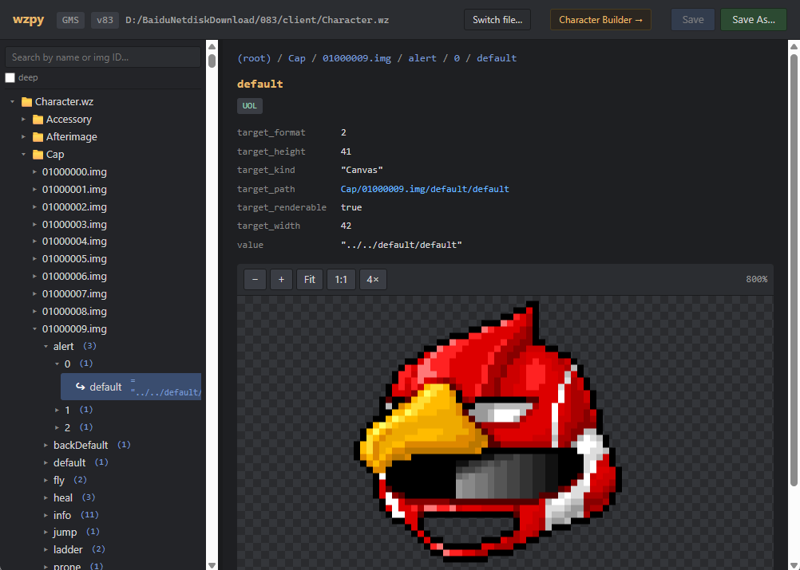
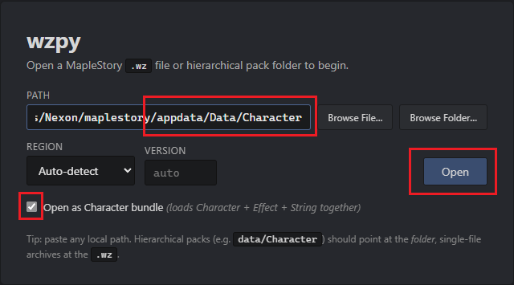

# wz-python

A Python reader for MapleStory `.wz` archives plus a small Flask UI to
browse the contents in your web browser. The parser is implemented from
scratch against the format documentation in
`Harepacker-resurrected/docs/wz-format/` (no `.NET` runtime required).

## What it supports
- Browse both Legacy 32-bit WZ container format and hierarchical 64-bit pack layout used by recent GMS clients.


- Character builder with your local wz data and export images.


Out of scope for now (the format docs cover them but they require more code):

- `.ms` Snowcrypt pack files (v220+)
- `.nm` MapleStoryN files

## Setup

```sh
python -m venv .venv
.venv\Scripts\activate          # Windows
# source .venv/bin/activate     # macOS / Linux
pip install -r requirements.txt
```

## Usage

> [!WARNING]
> **Do not load wz data while the game is open.**
> The game holds exclusive locks on its `.wz` files; loading them concurrently can corrupt the archives or crash the client.

Run the WebUI and load wz data:
```sh
python run.py
# then open http://127.0.0.1:5000, select `path/to/your/maplestory/appdata/Data/Character` folder (for GMS) or `path/to/your/maplestory/appdata/Data/Character.wz` file (for legacy MS)
```



Run directly with wz data:
```sh
python run.py path/to/Character           # hierarchical (latest GMS)
python run.py path/to/Character.wz        # legacy MS
```

Region is auto-detected by default. Override it if you see garbled text.

In the tree-browser, right-click any node for export options:

- **Export data as JSON** — single file (or, on a directory, a ZIP
  containing one `<entry>.img.json` per `.img`, with a progress modal).
- **Export data as XML** — HaSuite-compatible XML dump.
- **Export images** — every `Canvas` under the node as PNGs in a ZIP,
  either preserving the tree structure or flattened.

## CLI: convert_img.py

Convert WZ image data to JSON without spinning up the web UI:

```sh
# Whole archive → one <entry>.img.json per image, mirroring the WZ tree.
python convert_img.py Map.wz --region BMS

# A single entry inside the archive.
python convert_img.py Map.wz --region BMS --entry 400000000.img

# A standalone .img extracted with another tool — region auto-detected.
python convert_img.py 400000000.img --auto-region
```

For non-standard ciphers (private servers, exotic clients):

```sh
python convert_img.py exotic.img --iv 4D23C72B          # custom 4-byte IV
python convert_img.py exotic.img --auto-derive          # recover an 8-byte
                                                        # keystream from the
                                                        # 'Property' header
python convert_img.py exotic.img --keystream 96AE3FA4…  # raw keystream supply
```

If the file looks truncated mid-property (HaRepacker's "Save Image" has been
observed to drop the tail), the script emits as much JSON as it can parse
and prints a `WARNING: <name> appears truncated` to stderr.

## Library use

A normal WZ archive:

```python
from wzpy import WzFile
from wzpy.canvas import decode_canvas

with WzFile.open("Mob.wz", region="GMS") as wz:
    print("detected version:", wz.version)
    img = wz.root.get("0100100.img")        # WzImage
    stand = img.get("stand/0")              # WzCanvasProperty
    decode_canvas(stand, region="GMS").save("mob.png")

    for rel_path, image in wz.root.walk_images():
        image.parse()
        print(rel_path, len(image.children()))
```

A hierarchical 64-bit pack (latest GMS layout):

```python
from wzpy.wz_package import WzPackage

with WzPackage.open("Data/Character", region="GMS") as pkg:
    body = pkg.root.get("00002000.img")       # WzImage
    cap  = pkg.root.get("Cap/01000000.img")
    print(pkg.version, len(pkg._files), "underlying .wz files")
```

Composing a character:

```python
from wzpy.wz_package import WzPackage
from wzpy.character import CharacterRenderer

with WzPackage.open("Data/Character") as pkg:
    r = CharacterRenderer(pkg)
    r.compose(
        ["00002000", "00012000", "00030020", "00020000",
         "01000000", "01040002"],
        ear_type="humanEar",
    ).save("character.png")
```

A standalone `.img` file:

```python
from wzpy import WzImage, WzKey, detect_region_from_img
from wzpy.json_export import node_to_dict

with open("400000000.img", "rb") as f:
    data = f.read()

region = detect_region_from_img(data) or "GMS"
img = WzImage.from_bytes(data, key=WzKey.for_region(region),
                         name="400000000.img")
img.parse()
print(node_to_dict(img))
```

For unusual ciphers, supply a raw keystream:

```python
from wzpy import StaticWzKey, WzImage, derive_keystream_from_property

# Recover the first 8 keystream bytes from the file itself, or pass your
# own bytes if you have them.
key = StaticWzKey(derive_keystream_from_property(data))
img = WzImage.from_bytes(data, key=key, name="exotic.img")
```

## Reference

Built with reference to two upstream projects, with thanks to their authors:

- [lastbattle/Harepacker-resurrected](https://github.com/lastbattle/Harepacker-resurrected) — WZ format documentation and the canonical C# parser this implementation was checked against.
- [Elem8100/MapleNecrocer](https://github.com/Elem8100/MapleNecrocer) — character renderer and avatar-form logic that informed the Character Builder's z-order, vslot handling, and ear / pose rules.

## License

MIT (matches the upstream HaSuite project).
